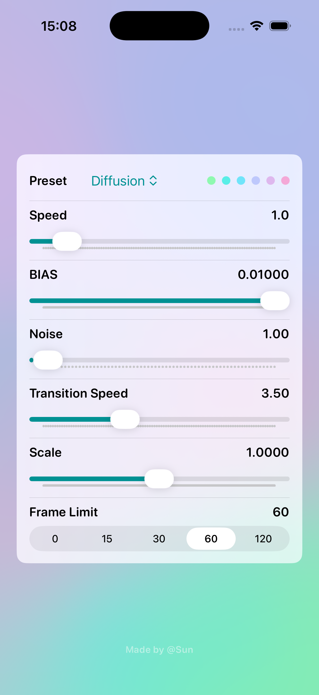
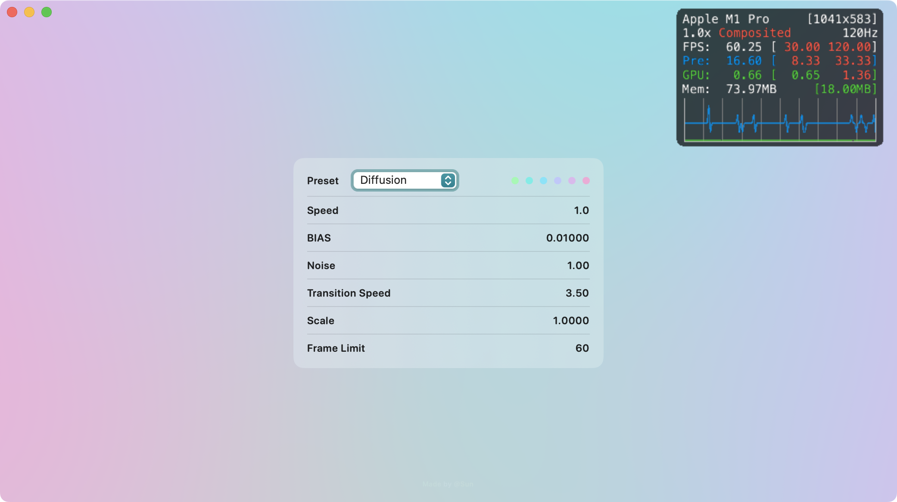

# DiffusionKit

DiffusionKit is a high-performance library designed for creating vibrant, animated mesh like gradient views. It offers powerful functionality and preset options as an enhanced alternative to SwiftUI’s MeshGradientView.

<p align="center">
  
  
</p>

## Platform

UIKit and AppKit platforms are generally supported.

```
platforms: [
    .iOS(.v14),
    .macOS(.v11),
    .tvOS(.v14),
    .visionOS(.v1),
],
```

## Usage

Add this package into your project.

```swift
dependencies: [
    .package(url: "https://github.com/sunimp/DiffusionKit.git", branch: "main"),
]
```

For more detailed information, feel free to explore our example projects. We've provided various presets for your convenience. Each one is identifiable within the demo application. For instance, check out `DiffusionPreset` to find the name, and then use `.constant(preset.colors)` to load it in `DiffusionView`.

### SwiftUI

For animated colors with default animation, use the following code:

```swift
import DiffusionKit

struct ContentView: View {
    // Just use [SwiftUI.Color], available up to 8 slot.
    @State var colors: [Color] = DiffusionPreset.aurora.colors

    var body: some View {
        DiffusionView(color: $colors)
            .ignoresSafeArea()
    }
}
```

Parameters to control the animation are follow:

```
@Binding var colors: [Color]
@Binding var speed: Double
@Binding var noise: Double
@Binding var transitionSpeed: Double

DiffusionView(
    color: $colors,
    speed: $speed,
    bias: $bias,
    noise: $noise,
    transitionSpeed: $transitionSpeed
)
```

For creating a static gradient, **parse `speed: 0` to `DiffusionView`**, or use the following code:

```swift
import DiffusionKit

struct StaticView: View {
    var body: some View {
        MulticolorGradient(parameters: .constant(.init(
            points: [
                .init(color: .init(.init(Color.red)), position: .init(x: 0, y: 0)),
                .init(color: .init(.init(Color.blue)), position: .init(x: 1, y: 0)),
                .init(color: .init(.init(Color.green)), position: .init(x: 0, y: 1)),
                .init(color: .init(.init(Color.yellow)), position: .init(x: 1, y: 1)),
            ],
            bias: 0.01,
            power: 4,
            noise: 32
        )))
    }
}
```

### UIKit/AppKit

For animated colors with default animation, use the following code:

```swift
import MetalKit
import DiffusionKit

let view = AnimatedMulticolorGradientView()
view.setColors(color, animated: false)
view.speed = speed
view.transitionDuration = transitionDuration
view.noise = noise
```

For creating a static gradient, use the following code:

```swift
import MetalKit
import DiffusionKit

let view = MulticolorGradientView()
view.parameters = .init(points: [
    .init(color: .init(r: 1, g: 0, b: 0), position: .init(x: 1, y: 0)),
    .init(color: .init(r: 0, g: 1, b: 0), position: .init(x: 0, y: 0)),
    .init(color: .init(r: 0, g: 0, b: 1), position: .init(x: 0, y: 1)),
    .init(color: .init(r: 1, g: 1, b: 1), position: .init(x: 1, y: 1)),
], bias: 0.01, power: 2, noise: 32)
```

### Customized Preset

Starting from DiffusionKit 1.0.0, we offer a new way to define presets. See the following example:

```swift
enum MyPresets: DiffusionColors {
    case white

    var colors: [ColorElement] {
        [
            make(255, 255, 255),
            make(244, 244, 244),
            make(233, 233, 233),
            make(222, 222, 222),
        ]
    }
}

// SwiftUI
DiffusionView(color: MyPresets.white)

// UIKit or AppKit
let view = AnimatedMulticolorGradientView()
view.setColors(MyPresets.white)
```


## License

This project is licensed under the MIT License - see the [LICENSE](LICENSE) file for details

The shader code originates from [this source](https://github.com/ArthurGuibert/SwiftUI-MulticolorGradient). Consequently, the name of the original author has been credited in the license file.
